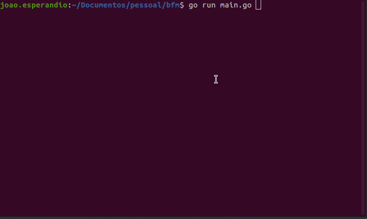

# bfm

Welcome to Bfm!

This tool is a simple directory builder, that can be used to create a path structure for projects.

All data are read from a yaml files, which is located in the layouts folder.